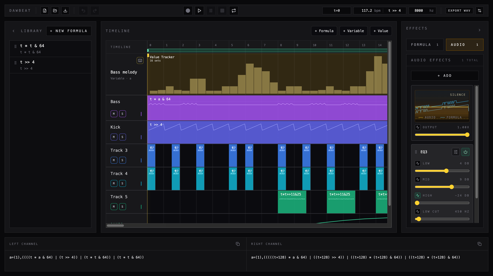

# DawBeat

Browser-based ByteBeat DAW focused on timeline composition, formula-driven sound design, modulation, automation, and live control.



## Overview

DawBeat combines a lightweight DAW workflow with a ByteBeat-first approach:

- Formula clips with inline editing and library formulas.
- Variable tracks, value tracker tracks, and automation lanes to modulate formulas over time.
- Real browser playback with loop editing, scrubbing, transport control, and timeline composition.
- Audio effects, automation recording, and offline WAV/MP3 export.
- Shared project snapshots plus a QR-based mobile companion for automation lanes.

The main app is desktop-oriented. On phones/tablets, the companion view is intended as a remote controller.

## Features

- Multi-lane timeline with formula tracks, variable tracks, value tracker tracks, automation lanes, and section labels.
- Clip editing workflows including move, resize, duplicate, marquee selection, group editing, copy/paste, nudging, and undo/redo history.
- Formula evaluation with waveform previews, an evaluated expression panel, and a Simplify button to replace the current formula with a simplified version.
- Variable tracks and value trackers with keyboard override, variable binding, MIDI CC, MIDI Note, MIDI learn, and live recording workflows.
- Automation lanes for master gain and audio effect parameters, including curve controls and live remote input.
- Audio effects: Auto Filter, Auto Panner, Auto Wah, BitCrusher, Chebyshev, Chorus, Compressor, Distortion, EQ3, Feedback Delay, Freeverb, Gate, JC Reverb, Limiter, Mid/Side Compressor, Multiband Compressor, Phaser, Ping Pong Delay, Pitch Shift, Reverb, Stereo Widener, Tremolo, Vibrato, and Master Gain.
- Transport controls with editable BPM unit, sample rate, bytebeat type (ByteBeat / FloatBeat / Signed ByteBeat), looping, and external MIDI Clock receive/lock state.
- Clip splitting via right-click context menu on clips and the timeline (Split All at playhead position).
- Timeline right-click context menu for adding section labels, splitting all clips at a time position, and inserting bars.
- WAV, MP3, and OGG Opus export with full renders or looped render passes.
- Auto-save in `localStorage` plus JSON project import/export.
- Immutable shared snapshots via Supabase (`/#/app/p/:id`).
- PeerJS-based remote companion with shareable lane QR links (`/#/app/companion`).

## Stack

- Vue 3 + Composition API
- Pinia
- Vue Router (hash history)
- Vite
- Tailwind CSS v4
- Tone.js (audio/effects)
- PeerJS (remote companion)
- lamejs (MP3 encoding)
- ogg-opus-encoder / WebAssembly Opus encoder (OGG Opus encoding)

## Requirements

- Node.js 20+ recommended
- Yarn
- Modern browser with Web Audio support
- For MIDI: browser with Web MIDI support (usually secure context: HTTPS or localhost)

## Installation

```bash
yarn install
```

## Supabase Snapshot Sharing Setup

Set these env vars before running the app:

```bash
VITE_SUPABASE_URL=https://your-project.supabase.co
VITE_SUPABASE_PUBLISHABLE_DEFAULT_KEY=your-public-publishable-key
# Optional fallback alias also accepted:
# VITE_SUPABASE_ANON_KEY=your-public-anon-key
```

Create the snapshot table:

```sql
create table if not exists projects (
  id uuid primary key default gen_random_uuid(),
  data jsonb not null,
  created_at timestamp default now()
);
```

Enable RLS and public policies for this minimal version:

```sql
alter table projects enable row level security;

create policy "public read"
on projects for select
using (true);

create policy "public insert"
on projects for insert
with check (true);
```

Canonical shared route format uses hash routing:

```text
/#/app/p/:id
```

Example:

```text
https://dawbeat.com/#/app/p/6f1c8c2e
```

Older `/#/p/:id` links still redirect to the current route.

## Development

```bash
yarn dev
```

Vite runs with --host, so you can open the app from other devices on your local network.

## Build and Preview

```bash
yarn build
yarn preview
```

## Scripts

- yarn dev: start development server.
- yarn build: create production build.
- yarn preview: preview production build locally.

## Quick Start

1. Click START to initialize audio.
2. Create or edit clips in the timeline, or load a bundled demo with Shuffle Demo.
3. Add modulation with variable tracks, value trackers, or automation lanes.
4. Adjust BPM, measure, and sample rate from the transport toolbar.
5. Enable loop to iterate on a section and use record for automation/value capture when needed.
6. Use Export to generate WAV, MP3, or OGG Opus, or Save JSON for a local project file.
7. Press Share to create an immutable Supabase snapshot and copy a shared URL.

## Keyboard Shortcuts

- Space: play/pause.
- L: toggle loop.
- ArrowLeft / ArrowRight: nudge selected clips.
- Shift + ArrowLeft / Shift + ArrowRight: nudge without strict snap behavior.
- ArrowUp / ArrowDown: adjust selected automation point value.
- Cmd/Ctrl + C: copy selected clips.
- Cmd/Ctrl + V: paste at playhead.
- Cmd/Ctrl + Z: undo.
- Cmd+Shift+Z or Ctrl+Y: redo.
- 0-9 and A-F: quick value input for value trackers (hex-like input).

## Mobile Companion

The app includes a dedicated remote-control route:

- Route: `#/app/companion`
- Connection: scan/open the shared QR link from an automation lane.
- Behavior: the companion sends gestures and values for subscribed lanes.

Older `#/companion` links still redirect to the current route.

If you open the main app on mobile, you will see a desktop-only notice with guidance to use companion mode.

## Project Persistence and Format

- Auto-save: project state is saved in localStorage.
- Exchange: JSON import/export for sharing and backup.
- Version migration: payload normalization is applied on load for compatibility.

## Project Structure

```text
src/
  components/
    timeline/      # Timeline, lanes, menus, and editing
    transport/     # Toolbar, transport, export/settings/about
    effects/       # Audio effect UI
    companion/     # Remote controller view
    ui/            # Dialogs, panels, and base UI components
  services/        # Domain logic (audio, MIDI, export, persistence, formulas, etc.)
  stores/          # Global state (Pinia)
  engine/          # Timeline/formula evaluation runtime
  composables/     # Reusable UI and transport interactions
  views/           # LandingView, DawView, and CompanionView
```

## Architecture Notes

- In main.js, automatic project persistence is initialized only outside companion mode.
- Hash-based routing is used to simplify static hosting.
- Export rendering is offline and applies formulas, automation, and supported effects.

## Current Status

This repository is under active development and already includes a full functional base for composition, automation, MIDI workflows, and export.
